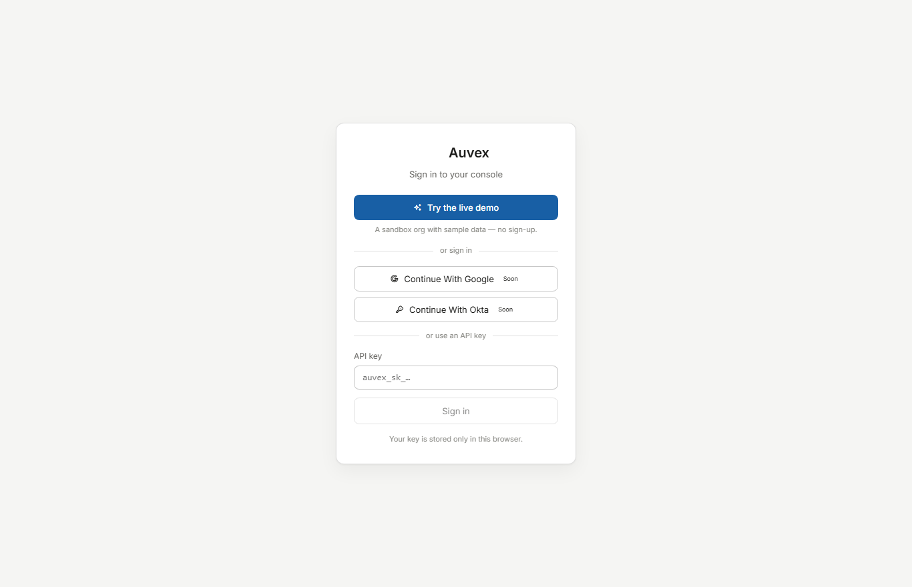
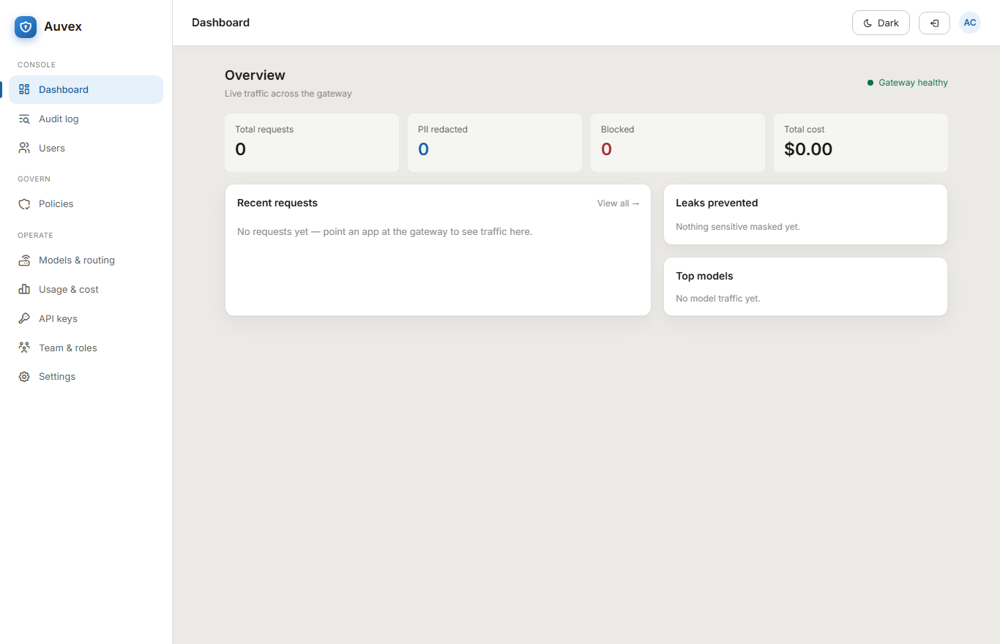
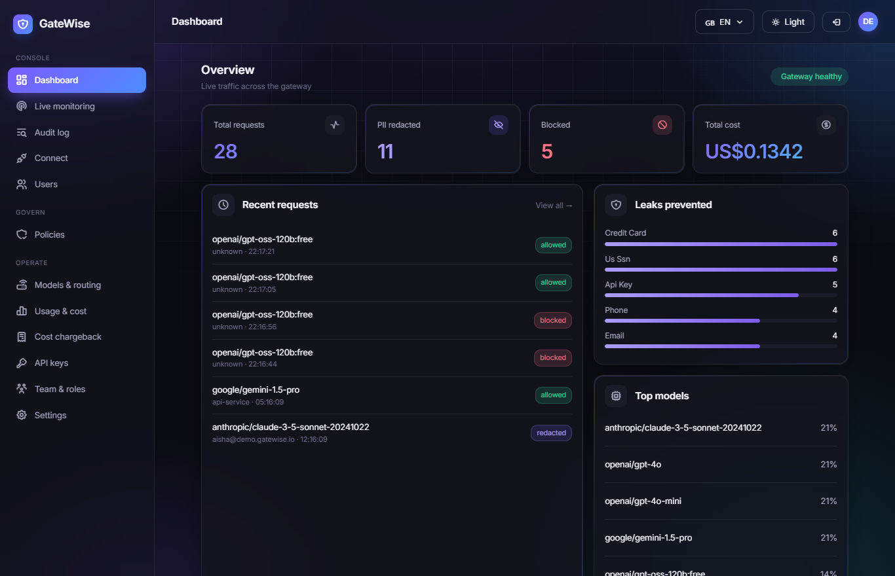
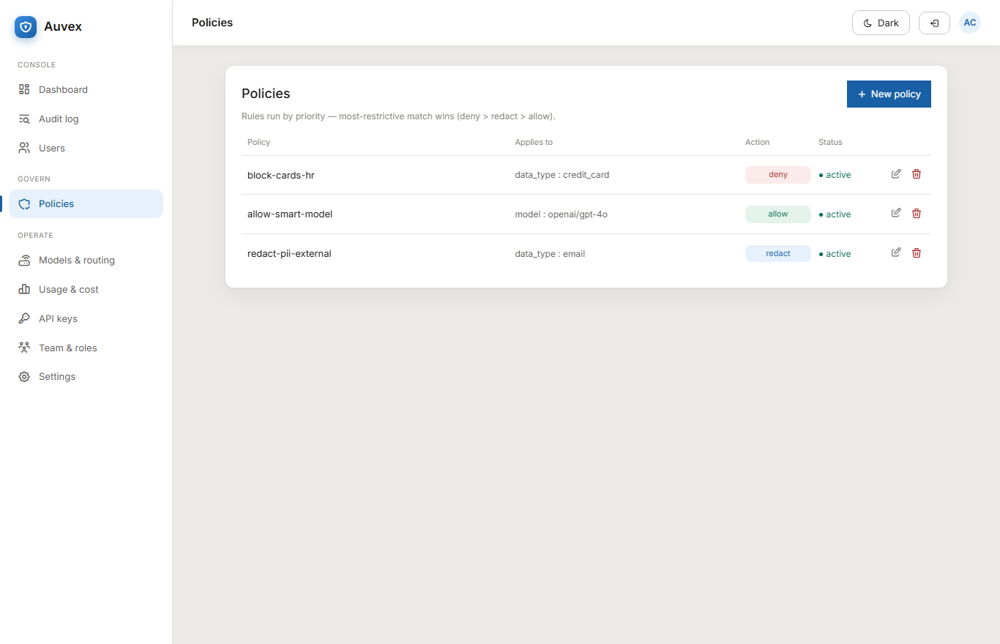
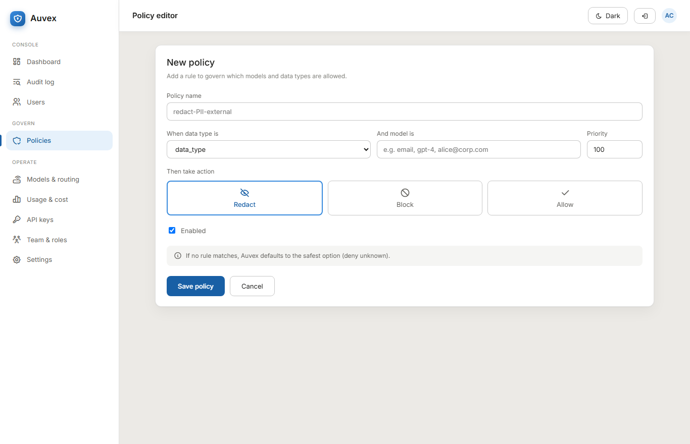
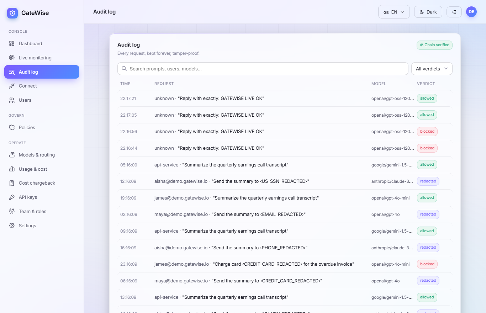
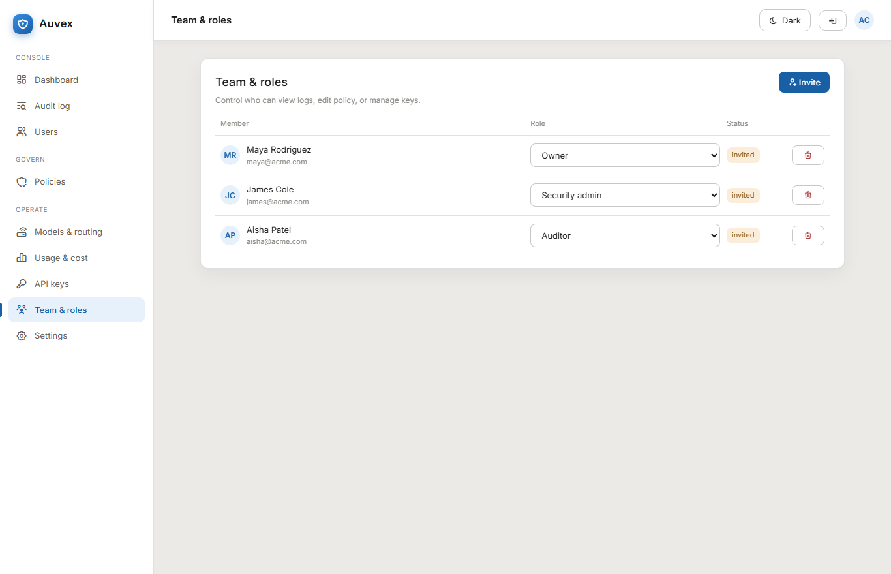

# Auvex

**A drop-in AI gateway that redacts, routes, governs, and logs every LLM call an enterprise makes.** Point one URL at Auvex and every prompt flows through a single controlled, audited passage.

> **Badges** (CI · Security · CodeQL · Coverage · Tests · License) wire to the live GitHub Actions workflows on the first push. They're intentionally omitted until then — no decorative or fake badges.

## What it does

Auvex sits between an enterprise's apps and the model providers they use. Because it speaks the **OpenAI-compatible API**, any app, SDK, or tool that already talks to OpenAI switches to Auvex by changing **one line** — the base URL and key. From then on, every call is authenticated to a tenant, has its **PII and secrets masked before it leaves the network**, is checked against **per-tenant allow/deny policy**, is recorded in an **immutable, hash-chained audit log**, and is forwarded to the chosen model.

**Ask `X` → get `Y`:**

```bash
curl https://your-auvex/v1/chat/completions \
  -H "Authorization: Bearer auvex_<your-key>" \
  -H "Content-Type: application/json" \
  -d '{"model":"smart","messages":[{"role":"user","content":"email jane@acme.com about card 4012888888881881"}]}'
# → the provider receives: "email ‹EMAIL_REDACTED› about card ‹CARD_REDACTED›"
#   the call is policy-checked, audited (redacted), and the response is returned.
```

## Integrate your app — any platform

Auvex is **OpenAI-compatible**, so every SDK, framework and tool works by changing one line — the base URL and key. The in-console **Connect** page generates these pre-filled with your URL + key.

```python
# Python (openai)
from openai import OpenAI
client = OpenAI(base_url="https://your-gateway/v1", api_key="auvex_sk_...")
client.chat.completions.create(model="smart", messages=[{"role": "user", "content": "Hello"}])
```
```javascript
// Node / TypeScript (openai)
import OpenAI from "openai";
const client = new OpenAI({ baseURL: "https://your-gateway/v1", apiKey: "auvex_sk_..." });
await client.chat.completions.create({ model: "smart", messages: [{ role: "user", content: "Hello" }] });
```
```python
# LangChain
from langchain_openai import ChatOpenAI
llm = ChatOpenAI(base_url="https://your-gateway/v1", api_key="auvex_sk_...", model="smart")
```

**No-code / existing tools** — set the OpenAI endpoint to your Base URL: **Cursor · Continue.dev · n8n · Open WebUI · LibreChat · Flowise / Dify · Vercel AI SDK**. Full API in [`docs/openapi.yaml`](docs/openapi.yaml) (+ a [Postman collection](docs/auvex.postman_collection.json)).

## Live demo

**🔗 Live (hosted): https://auvex.54.170.218.176.nip.io** — open it and click **"Try the live demo"** for a sandbox org pre-seeded with real governed traffic (no key, no sign-up). Or run the whole stack locally in one command — `docker compose up -d --build` — and open **http://localhost:3000**.



## Cost

**Runs 100% free.** Local development is `docker compose up` (Postgres + Redis + the gateway). The target production deploy is AWS **free-tier** (single EC2 running `docker compose`, RDS, S3 + CloudFront), and the model calls go to an OpenAI-compatible provider (OpenRouter, with free models available).

## Hero demo



The admin console, served from the same stack — see [more screenshots below](#screenshots). All real captures of the running app, never mocked.

## Quick start

**Docker (recommended) — the whole stack, one command:**

```bash
docker compose up --build --wait
# gateway :8080 + React console :3000, with Postgres + Redis, all health-gated
curl http://localhost:8080/actuator/health   # {"status":"UP"}
# then open the console:  http://localhost:3000   (sign in with an API key)
```

**Local dev:**

```bash
# gateway (needs Java 21):
./gradlew :gateway:bootRun        # or: ./gradlew :gateway:bootJar && java -jar gateway/build/libs/gateway.jar
# console (hot reload; proxies the API to :8080):
cd console && npm install && npm run dev   # http://localhost:5173
```

**Tests & quality gates (all free, all must pass):**

```bash
./gradlew build           # compile + Spotless + Checkstyle + SpotBugs + tests + JaCoCo
./gradlew spotlessCheck   # formatting
./gradlew test            # unit + real-infra integration tests (Testcontainers; needs Docker)
```

Set `OPENROUTER_API_KEY` (see `.env.example`) before making real model calls.

## CI/CD pipeline

Every push and PR runs the same canonical pipeline (GitHub Actions, least-privilege, concurrency-cancel, pinned versions):

- **CI** (`ci.yml`) — JDK 21 + Gradle: `./gradlew build`, i.e. Spotless, Checkstyle, SpotBugs, all tests, and JaCoCo coverage; uploads the reports.
- **Security** (`security.yml`) — gitleaks over full history + a Trivy filesystem scan (fail on fixable CRITICAL/HIGH), plus a weekly sweep.
- **CodeQL** (`codeql.yml`) — SAST on the Java backend (the TypeScript console joins the matrix when it lands).
- **Dependabot** — weekly Gradle, GitHub Actions, and Docker base-image updates.

## Features

- **Drop-in, OpenAI-compatible proxy** — `POST /v1/chat/completions`; change one URL.
- **Multi-tenant + API-key auth** — every request resolves a tenant by a hashed key; strict isolation.
- **Multi-model routing** — a config alias (`fast`, `smart`, …) switches the real provider model; the routing table is the model allow-list.
- **PII / secret redaction** — emails, credit cards (Luhn-checked), IBANs (mod-97), AWS keys, JWTs, PEM blocks — masked **before** the prompt leaves.
- **Allow / deny policy** — per-tenant rules by model, data-type, or user; deny-wins precedence; managed over REST.
- **Immutable audit log** — append-only, per-tenant SHA-256 hash chain; tamper-evident, queryable, verifiable.
- **Usage metrics**, **Redis response cache**, **per-tenant budgets** (429 over limit), **provider failover**, and an opt-in **Kafka async audit** pipeline.
- **Full endpoint coverage** — chat, **Responses API** (`/v1/responses`), embeddings, image generation, and a **native moderation** endpoint that screens text locally (PII, secrets, prompt-injection, and content-safety categories) with no provider call.
- **Provider adapters** — OpenAI-compatible, **Anthropic**, **Google Gemini**, **Azure OpenAI**, and **AWS Bedrock** (native SigV4 signing); each translates to/from the OpenAI shape, so governance is provider-agnostic.
- **Content safety & prompt-injection** — intent-focused detection across self-harm, violence, harassment, hate and sexual categories, plus injection/jailbreak rules (detect-and-allow, or block on a flag).
- **Real OIDC SSO** — Authorization Code flow (Google/Okta/any OIDC) with full id_token verification (RS256 via JWKS, issuer/audience/expiry/nonce), CSRF-safe signed state, and member auto-provisioning.
- **Human-in-the-loop approval** — hold high-risk calls (by data type or detected injection) for a reviewer; an approved prompt is then allowed through. **Per-user/model daily quotas** and a **semantic (near-duplicate) cache** round out the controls.
- **Reach every user** — drop-in **Python & JavaScript SDKs**, a **browser extension** that screens prompts on web AI tools, a **Tauri desktop app** that routes a whole machine's AI traffic through the gateway, and a **Helm chart + Kubernetes manifests** for cluster deployment.

## Architecture

A Spring Boot (Java 21, virtual threads) gateway over Postgres + Redis, with an opt-in Kafka path. Real endpoints:

| Method | Path | Purpose |
|---|---|---|
| `POST` | `/v1/chat/completions` | the proxy hot path |
| `POST` | `/v1/responses` | OpenAI Responses API (governed) |
| `POST` | `/v1/embeddings`, `/v1/images/generations` | governed embeddings & image generation |
| `POST` | `/v1/moderations` | native local screen (PII, secrets, injection, content-safety) |
| `POST` | `/v1/audio/speech`, `/v1/audio/transcriptions` | governed text-to-speech & speech-to-text |
| `POST` | `/v1/mcp` | MCP server (JSON-RPC governance tools) |
| `GET` | `/v1/discovery` | shadow-AI discovery — un-sanctioned model usage |
| `GET` | `/v1/compliance/report` | controls mapped to GDPR / EU AI Act / DORA |
| `GET/POST` | `/v1/approvals[/{id}/decision]` | human-in-the-loop review queue |
| `GET` | `/v1/me` | the tenant behind your key |
| `GET/POST/PUT/DELETE` | `/v1/policies[/{id}]` | manage your policy rules |
| `GET` | `/v1/audit`, `/v1/audit/verify` | query the audit log; verify the chain |
| `GET` | `/v1/usage` | per-tenant usage summary |
| `GET` | `/auth/oidc/{provider}/login` | start an OIDC sign-in (Google/Okta/…) |
| `GET` | `/actuator/health` | health probe |

The full set of diagrams — architecture, request sequence, ER, component map, request state machine, trust boundaries, and deployment — is in **[docs/ARCHITECTURE.md](docs/ARCHITECTURE.md)**.

## Screenshots

Real captures of the running console (gateway → Postgres, not mocked):

| | |
|---|---|
|  |  |
| **Dashboard** — usage, leaks prevented, recent requests | **Dark theme** — one toggle, design-token driven |
|  |  |
| **Policies** — allow / redact / deny, most-restrictive wins | **Policy editor** — the three-way action |
|  |  |
| **Audit log** — search, filter, live **chain-verified** badge | **Team & roles** — owner / security-admin / auditor |

Metrics read $0 until a real `OPENROUTER_API_KEY` drives live traffic through the gateway.

## Approach & decisions

The gateway runs each request through a fixed pipeline — **authenticate → route → redact → policy → budget → audit → forward** — so the provider only ever sees an allowed, already-redacted request, and every decision is recorded either way. Highlights:

- **Redaction** is a small detector SPI: a regex finds candidates, a pure validator (Luhn, IBAN mod-97) confirms them, and an overlap resolver guarantees nothing is double-masked. It's JDK-only and exhaustively unit-tested.
- **Audit** is an append-only, per-tenant hash chain: each entry's hash folds in the previous one over a length-prefixed canonical form, so any later edit is detectable. Appends serialize per tenant via a Postgres advisory lock so concurrent writes can't fork the chain.
- **Policy** is a pure, deterministic engine (priority wins, deny breaks ties, default-deny among configured rules), loaded from the `policy` table per tenant.

See **[docs/ARCHITECTURE.md](docs/ARCHITECTURE.md)** for the diagrams behind each.

## Productionizing & scaling

✍️ TODO: my words.

## Key technical decisions & why

✍️ TODO: my words.

## Engineering standards I followed (and skipped)

✍️ TODO: my words.

## How I used AI tools in development

✍️ TODO: my words.

## What I'd do differently with more time

✍️ TODO: my words.

## Edge cases knowingly skipped

✍️ TODO: my words.

## License

MIT © 2026 Gauthambinoy20. See [LICENSE](LICENSE).

## About / Topics

A drop-in, OpenAI-compatible AI gateway for the enterprise: redact, route, govern, and log every LLM call.

**Topics:** `ai-gateway` · `llm` · `spring-boot` · `java` · `pii-redaction` · `governance` · `audit-log` · `multi-tenant` · `openai-compatible` · `kafka` · `redis` · `postgresql`
