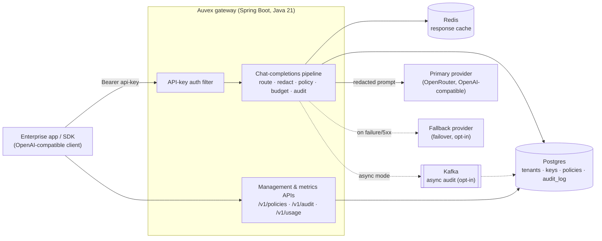
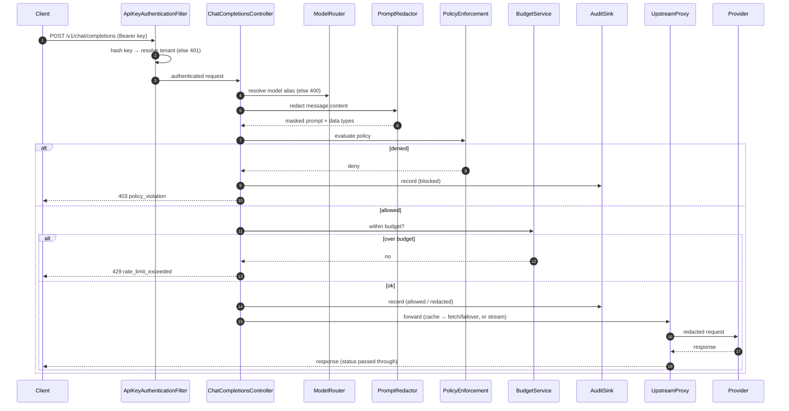
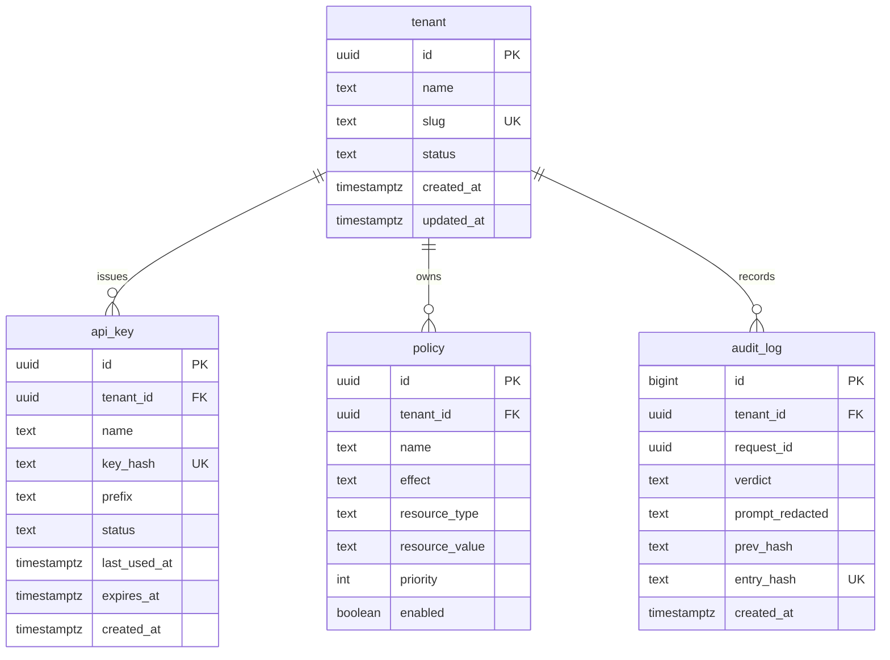
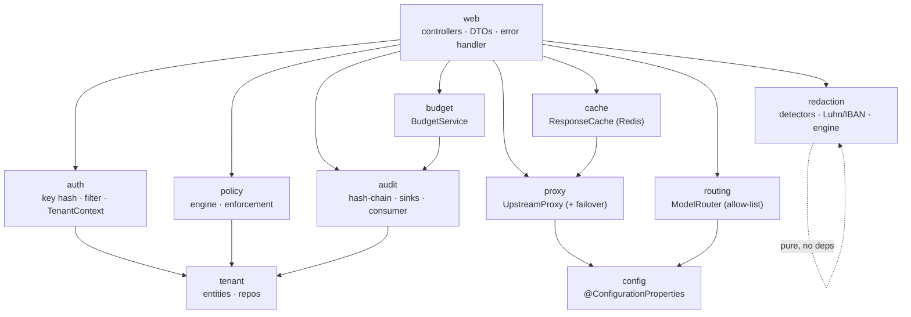
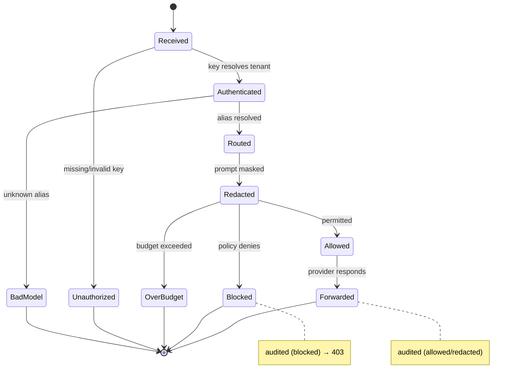
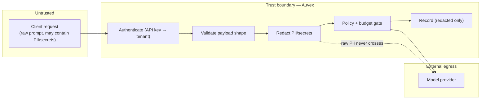
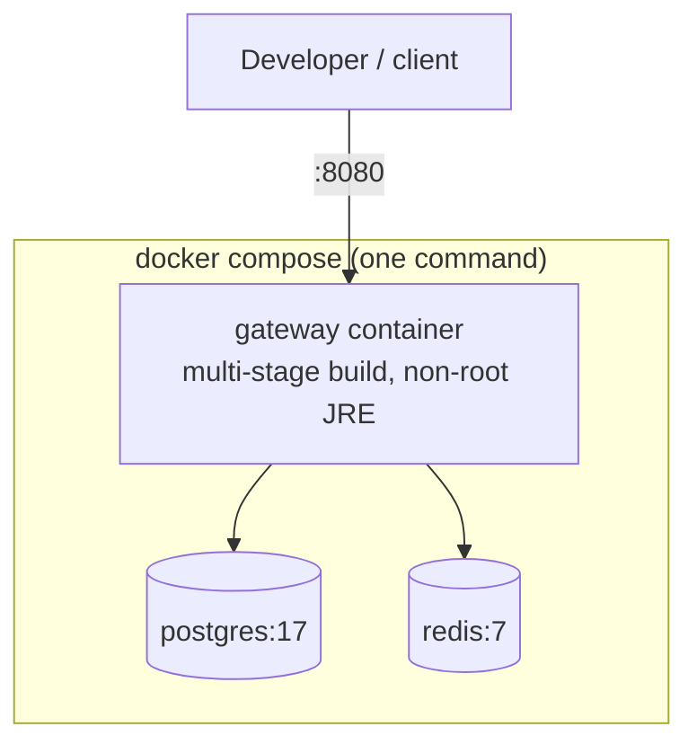

# Auvex — Architecture

Diagrams are **Mermaid** (they render natively on GitHub) and are derived from the
real code, not invented. Every node maps to a real module, route, table, or
container. If the code changes, the affected diagram changes with it.

Auvex is a drop-in, OpenAI-compatible **AI gateway**: an app points its base URL at
Auvex instead of the provider, and every LLM call then flows through one controlled
passage that **authenticates**, **routes**, **redacts**, **governs**, **logs**, and
forwards it.

---

## 1. System architecture

All components and how they connect.

**Caption:** the gateway is the single control point; Postgres is the source of
truth, Redis is a best-effort cache, Kafka is an opt-in async path for audit
writes, and the providers are the only external egress — reached only with an
already-redacted prompt.

---

## 2. Request lifecycle (the hot path)

The core `POST /v1/chat/completions` flow, end to end.

**Caption:** the provider is only ever reached on the allowed branch, with a
redacted prompt, and every outcome (blocked, over-budget, allowed) is decided
before any upstream work — and recorded.

---

## 3. Entity-Relationship — data model

Source of truth: `gateway/src/main/resources/db/migration/V1__init.sql` (+ V2 adds
the audit anti-fork constraint).

**Caption:** a tenant owns its keys (stored only as a hash + display prefix), its
policies, and an append-only, hash-chained audit log holding redacted text only.

---

## 4. Component / module map

The Java packages and their dependencies (web → domain → data).

**Caption:** the web layer orchestrates the domain modules; redaction is pure
(JDK-only, no Spring); config holds the typed, validated settings each module reads.

---

## 5. Request state machine

The states a request moves through, and where it can terminate.

**Caption:** every terminal state has a defined HTTP outcome; the two that involve
a real decision (Blocked, Forwarded) are written to the audit log.

---

## 6. Security / trust boundaries

What's untrusted, where it's checked, and what's allowed to cross to the provider.

**Caption:** untrusted input is authenticated, validated, and **redacted before it
crosses the boundary**; only redacted text is forwarded or stored, and policy +
budget gate the egress.

---

## 7. Deployment — local stack today

What `docker compose up` runs (the real, tested topology). The AWS topology
(VPC, EC2/RDS/S3+CloudFront, TLS, CI→GHCR→VM) is **Phase 5** and will be added
here when it's built as Terraform.

**Caption:** a single command boots gateway + Postgres + Redis, all health-gated;
the gateway image builds the jar from source in-stage and runs as a non-root user.
