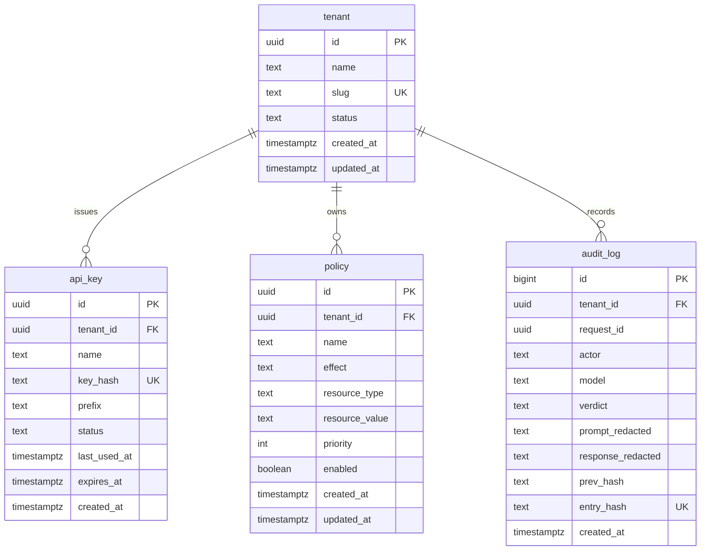

# Auvex — Architecture

Diagrams here are derived from the real code and kept in sync with it. More views
(request sequence, deployment topology, trust boundaries) are added as those
parts of the system land.

## Entity-Relationship — data model

Source of truth: `gateway/src/main/resources/db/migration/V1__init.sql`.

**What it shows:** a `tenant` is the unit of isolation; it issues `api_key`s
(stored only as a hash + display prefix), owns allow/deny `policy` rows, and
accumulates an append-only, hash-chained `audit_log`. The audit log keeps only
redacted text — raw PII never reaches it.
